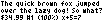
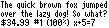
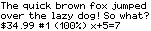

font-problems
=============

font-problems is a command-line tool for reading and writing console bitmap fonts. These are fonts described by a rectangular pixel matrix, used for small hardware projects like light-up signs or low-resolution terminals.

In particular, it can convert PSF files to and from BMP images, for easy editing, and export them as header files for C or rust projects.

## Building

Building and running requires [node.js](https://nodejs.org/).

    $ npm install
    $ ./bin/font-problems --help

## Formats

Supported formats are:

    .bmp    grid of glyphs
    .psf    portable screen font (used by Linux and PC DOS)
    .h      C header (output only)
    .rs     Rust header (output only)

### BMP files

A font in BMP format is a regular grid of glyphs. You can specify the glyph dimensions manually, though it can usually detect the borders automatically by noticing the empty pixels between letters. The glyphs are assumed to be drawn in a dark color (like black) on a light color (like white), though they can be read from a white-on-black file using `--reversed`.

Glyphs that aren't as wide as the cell should be pushed up against the left edge. For proportional fonts, font-problems will detect the whitespace on the right edge, and remove it.

### Header files

"Header file" format is a C or Rust header file with one constant each for the glyph width (monospace only) and height, and an array of cell data. You can use these to directly include a bitmap font in the source for your project.

For proportional fonts, there's also an array of offsets for indexing. The cell data for character _n_ starts at `offset[n]` (inclusive) and goes through `offset[n + 1]` (exclusive).

Each int is a single row or column of pixels, in LSB or MSB order. LSB (the default) means the left or top pixel is in the least-significant bit.

### PSF files

PSF file format is described here: http://www.win.tue.nl/~aeb/linux/kbd/font-formats-1.html

Each glyph must be the same width and height in a PSF file (monospace), and exactly 256 or 512 characters must be defined. BIOS only supports a glyph width of 8, so only framebuffers can use other widths.

Font-problems will generate a simple unicode mapping table for PSF files, which you can specify with "--map". This is a text file in a particular format, described here: [PSF map files](docs/psfmap.md)

## Sample fonts

Three sample fonts are included, in the [fonts/](./fonts/) folder:

- "Tom Thumb" is from [my blog](http://robey.lag.net/2010/01/23/tiny-monospace-font.html), with some line-drawing and block characters added, for console tools like Midnight Commander. Each cell is 4x6, which I believe is the smallest a bitmap font can be while still having any legibility.
    - 

- "Lola" is a simple proportional font, ranging from 4x8 to 6x8, in ASCII only. It was designed to work on LED matrix displays like [this one](https://learn.adafruit.com/32x16-32x32-rgb-led-matrix).
    - 

- "Oranj" is a 6x8 monospace font inspired by the Apple II, with support for most Latin glyphs.
    - 

All of these fonts are licensed as Creative Commons "share & adapt": http://creativecommons.org/licenses/by/4.0/

## License

Apache 2 (open-source) license, included in `LICENSE.txt`.

## Authors

@robey - Robey Pointer <robeypointer@gmail.com>
